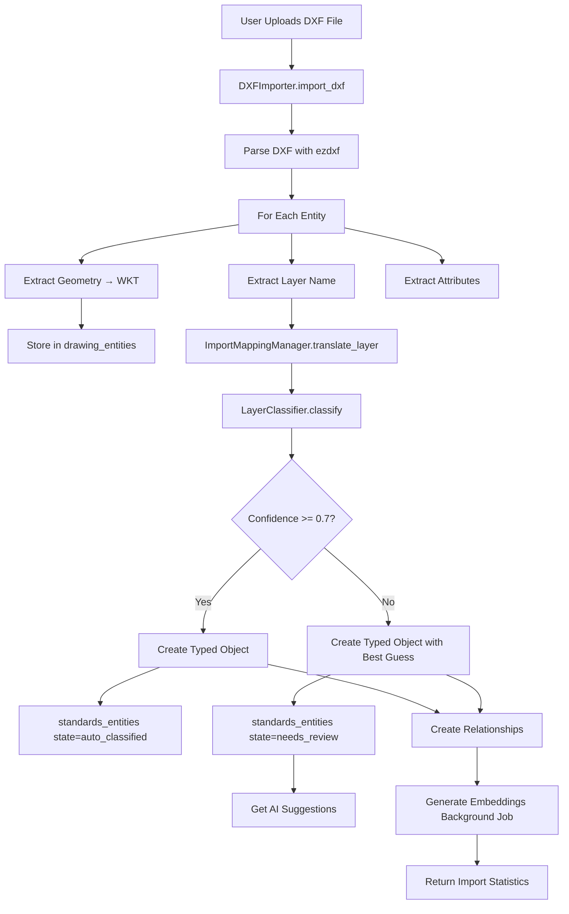
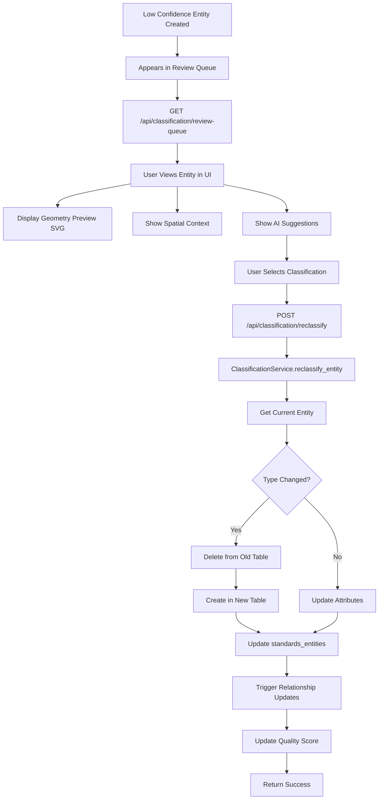
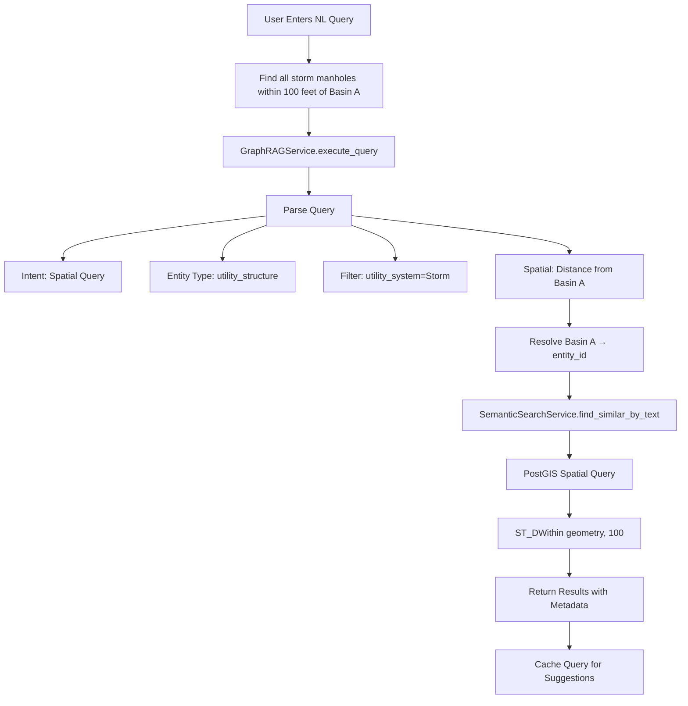
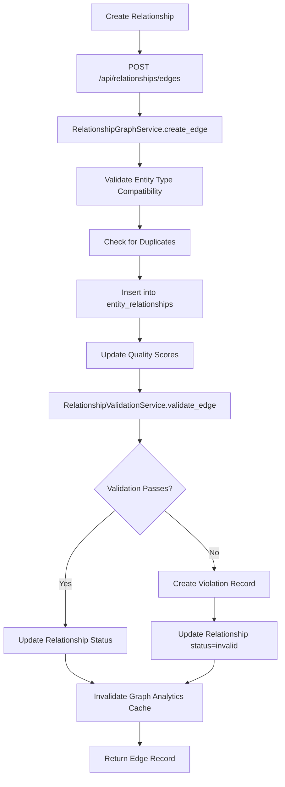
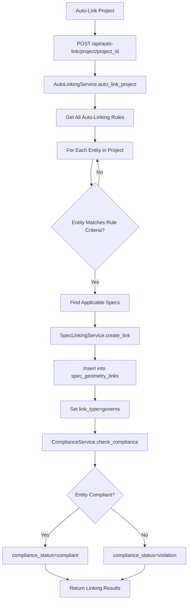
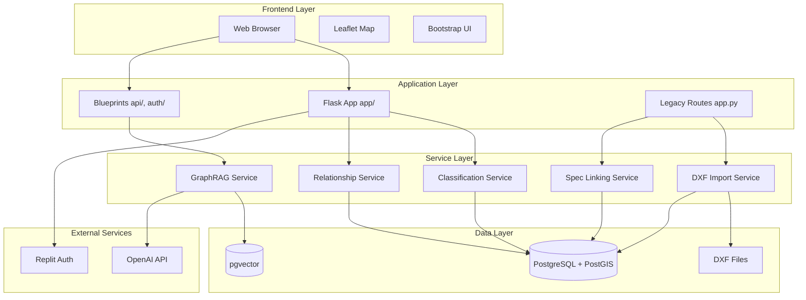
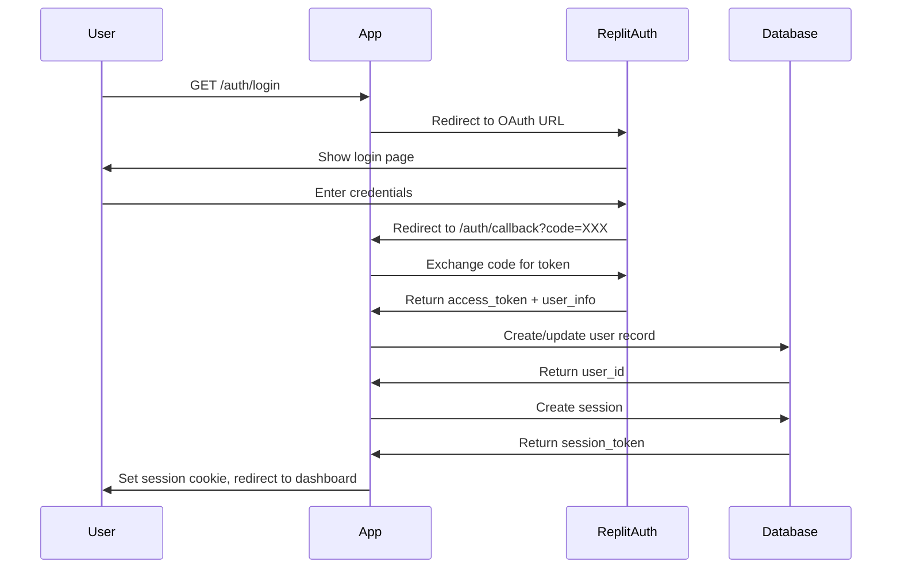

# Survey Data System - Architecture Documentation

**Version**: 2.0 (Refactored)
**Last Updated**: 2025-11-18
**Status**: Hybrid Legacy/Modern Architecture (Phase 2 Refactor In Progress)

---

## Table of Contents

1. [System Overview](#1-system-overview)
2. [Directory Structure](#2-directory-structure)
3. [Technology Stack](#3-technology-stack)
4. [Architectural Patterns](#4-architectural-patterns)
5. [Data Flow Diagrams](#5-data-flow-diagrams)
6. [Core Components](#6-core-components)
7. [Service Layer](#7-service-layer)
8. [Database Architecture](#8-database-architecture)
9. [Authentication & Authorization](#9-authentication--authorization)
10. [Key Business Flows](#10-key-business-flows)
11. [Refactor Status](#11-refactor-status)
12. [Security](#12-security)
13. [Performance Considerations](#13-performance-considerations)

---

## 1. System Overview

### 1.1 Purpose

The **Survey Data System** is a sophisticated CAD-GIS integration platform designed for civil engineering and surveying professionals. It imports DXF/CAD files, intelligently classifies entities into domain-specific objects (pipes, manholes, survey points, etc.), manages relationships between entities, links specifications, and provides AI-powered search and analytics capabilities.

### 1.2 Core Capabilities

- **DXF Import/Export**: Parse AutoCAD DXF files and store geometry in PostGIS
- **Intelligent Classification**: AI-powered entity classification with confidence scoring
- **Relationship Management**: Graph-based relationship tracking between entities
- **Specification Linking**: Link CSI MasterFormat specifications to geometric entities
- **Spatial Analysis**: PostGIS-powered spatial queries and analysis
- **AI Search**: Vector similarity search using OpenAI embeddings
- **GraphRAG**: Natural language queries against the knowledge graph
- **Quality Scoring**: Automated quality assessment of entities
- **Compliance Tracking**: Validate entities against specification requirements
- **Standards Management**: CAD standards library (layers, blocks, colors, etc.)

### 1.3 Domain Focus

**Civil Engineering & Land Surveying**:
- Utility infrastructure (water, sewer, storm drainage, gas, electric)
- Survey control networks and topographic data
- Site features (trees, pavement, structures)
- Grading and drainage analysis
- Alignment design (horizontal/vertical)
- Parcel boundaries and legal descriptions
- Specification compliance tracking

### 1.4 Current State

The system is undergoing a **major architectural refactor** from a monolithic `app.py` (24,698 lines) to a modular Application Factory pattern with blueprints.

**Hybrid Architecture**:
- **Modern**: Application factory (`app/`), blueprints (`api/`, `auth/`)
- **Legacy**: Monolithic routes (`app.py`) still active
- **Strategy**: Incremental migration without breaking changes

---

## 2. Directory Structure

```
survey-data-system/
├── app/                          # Modern Flask application package (NEW)
│   ├── __init__.py              # Application factory
│   ├── extensions.py            # Flask extensions (CORS, Cache)
│   └── config.py                # Configuration classes
│
├── api/                          # API blueprints (NEW)
│   ├── ai_search_routes.py      # AI/semantic search endpoints
│   ├── graphrag_routes.py       # GraphRAG natural language queries
│   ├── quality_routes.py        # Quality scoring endpoints
│   └── relationship_routes.py   # Relationship graph endpoints
│
├── auth/                         # Authentication module (NEW)
│   ├── routes.py                # Auth blueprint (OAuth, sessions)
│   ├── decorators.py            # Auth decorators (@login_required)
│   └── __init__.py
│
├── services/                     # Business logic layer
│   ├── ai_classification_service.py
│   ├── auth_service.py
│   ├── auto_linking_service.py
│   ├── classification_service.py
│   ├── compliance_service.py
│   ├── coordinate_system_service.py
│   ├── csi_masterformat_service.py
│   ├── dxf_test_generator_service.py
│   ├── entity_registry.py
│   ├── geometry_preview_service.py
│   ├── gis_snapshot_service.py
│   ├── graph_analytics_service.py
│   ├── graphrag_service.py
│   ├── project_mapping_service.py
│   ├── project_spec_service.py
│   ├── rbac_service.py
│   ├── relationship_analytics_service.py
│   ├── relationship_graph_service.py
│   ├── relationship_query_service.py
│   ├── relationship_set_service.py
│   ├── relationship_sync_checker.py
│   ├── relationship_validation_service.py
│   ├── report_generator.py
│   ├── semantic_search_service.py
│   ├── spec_library_service.py
│   ├── spec_linking_service.py
│   ├── spec_standards_service.py
│   └── validation_helper.py
│
├── templates/                    # Jinja2 HTML templates
│   ├── index.html               # Home page
│   ├── projects.html            # Project manager
│   ├── schema.html              # Schema viewer
│   ├── data_manager/            # Data management UIs
│   ├── standards/               # CAD standards UIs
│   └── tools/                   # Specialized tools
│
├── static/                       # Frontend assets
│   ├── js/                      # JavaScript
│   ├── css/                     # Stylesheets
│   └── images/                  # Images
│
├── tests/                        # Test suite
│   ├── conftest.py              # Pytest fixtures
│   ├── unit/                    # Unit tests
│   ├── integration/             # Integration tests
│   └── fixtures/                # Test data
│
├── app.py                        # LEGACY monolithic routes (24,698 lines)
├── run.py                        # Application entry point
├── database.py                   # Database utilities
├── dxf_importer.py              # DXF import engine
├── dxf_exporter.py              # DXF export engine
├── map_export_service.py        # Map export service
├── intelligent_object_creator.py # Entity classification logic
├── requirements.txt             # Python dependencies
└── .env                         # Environment variables

```

### 2.1 Hybrid State Explanation

**Why Hybrid?**
- The system has **3 years of production code** in `app.py`
- Cannot afford downtime or breaking changes
- Refactoring incrementally while maintaining stability

**Migration Strategy**:
1. Create application factory (`app/__init__.py`)
2. Extract routes to blueprints (auth, API endpoints)
3. Keep legacy `app.py` active via `run.py` import
4. Gradually move remaining routes to blueprints
5. Delete `app.py` when migration complete

**Current Refactor Phase**: Phase 2 (Routes → Blueprints)

---

## 3. Technology Stack

### 3.1 Backend

| Component | Technology | Version | Purpose |
|-----------|-----------|---------|---------|
| **Language** | Python | 3.11+ | Core language |
| **Framework** | Flask | 2.2+ | Web framework |
| **WSGI Server** | Werkzeug (dev) / Gunicorn (prod) | Latest | HTTP server |
| **Database Driver** | psycopg2 | 2.9+ | PostgreSQL adapter |
| **ORM** | **None** (Raw SQL) | N/A | Direct SQL queries |

### 3.2 Database

| Component | Technology | Version | Purpose |
|-----------|-----------|---------|---------|
| **Database** | PostgreSQL | 14+ | Primary data store |
| **PostGIS** | PostGIS | 3.x | Spatial extensions |
| **pgvector** | pgvector | 0.5+ | Vector similarity search |
| **SRID** | EPSG:2226 | N/A | California State Plane Zone 2 |

### 3.3 CAD/GIS Libraries

| Library | Purpose |
|---------|---------|
| **ezdxf** | DXF file parsing and generation |
| **pyproj** | Coordinate system transformations |
| **shapely** | Geometry manipulation |
| **geopandas** | Geospatial data export |

### 3.4 AI/ML

| Library | Purpose |
|---------|---------|
| **OpenAI API** | Text embeddings (text-embedding-3-small, 1536 dims) |
| **NetworkX** | Graph analytics (PageRank, centrality) |
| **scikit-learn** | Clustering (K-means, DBSCAN) |

### 3.5 Frontend (Inferred from templates)

| Library | Purpose |
|---------|---------|
| **Leaflet.js** | Interactive web maps |
| **Mapbox GL JS** | Vector tile rendering |
| **Bootstrap** | UI framework |
| **HTMX** | Dynamic interactions |

### 3.6 Utilities

| Library | Purpose |
|---------|---------|
| **Flask-CORS** | Cross-origin request handling |
| **Flask-Caching** | Route result caching |
| **WeasyPrint** | PDF generation |
| **openpyxl** | Excel file generation |
| **Pillow** | Image processing |
| **python-dotenv** | Environment variable management |

---

## 4. Architectural Patterns

### 4.1 Application Factory Pattern ⭐ NEW

**Location**: `app/__init__.py`

**Purpose**: Create multiple Flask app instances with different configurations (dev, test, prod)

```python
from app import create_app

app = create_app('production')  # or 'development', 'testing'
```

**Benefits**:
- Environment-specific configuration
- Better testability (create test app instances)
- Avoid circular imports
- Initialize extensions safely

### 4.2 Blueprint Pattern ⭐ NEW

**Purpose**: Modularize routes into logical groups

**Implemented Blueprints**:
- `auth_bp` - Authentication routes (`/auth/*`)
- `ai_search_bp` - AI search routes (`/api/ai/search/*`)
- `quality_bp` - Quality scoring routes (`/api/ai/quality/*`)
- `graphrag_bp` - GraphRAG routes (`/api/graphrag/*`)
- `relationship_bp` - Relationship routes (`/api/relationships/*`)

**Registration** (in `app/__init__.py`):
```python
flask_app.register_blueprint(auth_bp)
flask_app.register_blueprint(graphrag_bp)
flask_app.register_blueprint(ai_search_bp)
flask_app.register_blueprint(quality_bp)
```

### 4.3 Service Layer Pattern

**Purpose**: Separate business logic from routes

**Structure**:
```
Route → Service → Database
```

**Example**:
```python
# Route (thin controller)
@app.route('/api/classification/reclassify', methods=['POST'])
def reclassify_entity():
    data = request.get_json()
    result = ClassificationService().reclassify_entity(data)
    return jsonify(result)

# Service (business logic)
class ClassificationService:
    def reclassify_entity(self, data):
        # Validation
        # Database operations
        # Update relationships
        # Return result
```

**Benefits**:
- Testable business logic
- Reusable across routes
- Clear separation of concerns

### 4.4 Repository Pattern (Implicit)

**Purpose**: Abstract database access

**Implementation**: Service methods act as repositories

**Example**:
```python
class RelationshipGraphService:
    def get_edge(self, edge_id):
        """Repository method for edge retrieval"""
        query = "SELECT * FROM entity_relationships WHERE relationship_id = %s"
        return execute_query(query, (edge_id,))
```

### 4.5 Standards-Based Architecture (Domain-Driven Design)

**Purpose**: Align code structure with civil engineering domain

**Key Concepts**:
- Entity types match civil engineering objects
- Standards tables for reference data
- Vocabulary tables for controlled terms
- Specifications linked to geometry

**Central Registry**: `standards_entities` table

```python
# Entity Registry maps entity types to tables
ENTITY_REGISTRY = {
    'utility_line': ('utility_lines', 'line_id'),
    'utility_structure': ('utility_structures', 'structure_id'),
    'survey_point': ('survey_points', 'point_id'),
    # ...
}
```

### 4.6 Decorator Pattern (Authentication)

**Purpose**: Declarative access control

**Decorators**:
```python
@login_required                          # Require authentication
@role_required('ADMIN')                  # Require admin role
@permission_required('standards', 'CREATE')  # Fine-grained permission
@project_permission_required('WRITE')    # Project-level access
```

**Implementation** (`auth/decorators.py`):
```python
from functools import wraps
from flask import session, redirect

def login_required(f):
    @wraps(f)
    def decorated_function(*args, **kwargs):
        if 'user_id' not in session:
            return redirect('/auth/login')
        return f(*args, **kwargs)
    return decorated_function
```

### 4.7 Caching Strategy

**Levels**:
1. **Route caching**: Flask-Caching for GET endpoints
2. **In-memory caching**: Graph analytics results
3. **Database caching**: PostgreSQL query plan caching

**Example**:
```python
from app.extensions import cache

@cache.cached(timeout=300, key_prefix='project_stats')
def get_project_statistics():
    # Expensive query
    return results
```

---

## 5. Data Flow Diagrams

### 5.1 DXF Import Data Flow



### 5.2 Entity Classification Review Flow



### 5.3 Natural Language Query Flow



### 5.4 Relationship Management Flow



### 5.5 Specification Linking Flow



### 5.6 High-Level System Architecture



---

## 6. Core Components

### 6.1 DXF Importer (`dxf_importer.py`)

**Purpose**: Parse DXF files and store entities in PostGIS database

**Key Methods**:
```python
class DXFImporter:
    def import_dxf(self, file_path: str, project_id: str) -> dict:
        """Main import orchestrator"""

    def _import_modelspace(self, msp, project_id: str):
        """Import model space entities"""

    def _process_entity(self, entity, project_id: str):
        """Process individual DXF entity"""

    def _import_points(self, entity, project_id: str):
        """Import POINT entities"""

    def _import_lines(self, entity, project_id: str):
        """Import LINE entities"""

    def _import_polylines(self, entity, project_id: str):
        """Import LWPOLYLINE/POLYLINE entities"""

    def _translate_layer_name(self, layer_name: str) -> str:
        """Apply import mappings to layer names"""
```

**Entity Types Supported**:
- POINT
- LINE
- LWPOLYLINE
- POLYLINE
- 3DFACE
- TEXT / MTEXT
- DIMENSION
- HATCH
- INSERT (block references)

**Coordinate Systems**:
- EPSG:2226 (California State Plane Zone 2) - Primary
- EPSG:4326 (WGS84) - Web display
- Local/Assumed coordinates

**Process**:
1. Open DXF with ezdxf library
2. Extract entities from model space
3. Convert geometry to WKT (Well-Known Text)
4. Translate layer names via import mappings
5. Store in `drawing_entities` table
6. Trigger intelligent object creation

### 6.2 Intelligent Object Creator (`intelligent_object_creator.py`)

**Purpose**: Convert raw DXF entities into typed domain objects

**Key Methods**:
```python
class IntelligentObjectCreator:
    def create_from_entity(self, entity_record: dict) -> dict:
        """Main entry point - creates typed object from DXF entity"""

    def _create_utility_line(self, entity_record: dict) -> dict:
        """Create pipe or utility line"""

    def _create_utility_structure(self, entity_record: dict) -> dict:
        """Create manhole, vault, valve, etc."""

    def _create_survey_point(self, entity_record: dict) -> dict:
        """Create survey point"""

    def _create_site_tree(self, entity_record: dict) -> dict:
        """Create tree inventory item"""
```

**Classification Logic**:
```python
# Step 1: Classify layer name
classification = LayerClassifier().classify(layer_name)
# Returns: {'entity_type': 'utility_structure', 'confidence': 0.85, ...}

# Step 2: Create typed object
if classification['confidence'] >= 0.7:
    # High confidence - auto-classify
    create_typed_object(classification['entity_type'])
    create_standards_entity(state='auto_classified', confidence=0.85)
else:
    # Low confidence - needs review
    create_typed_object(best_guess_type)
    create_standards_entity(state='needs_review', confidence=0.45)
    get_ai_suggestions()
```

**Supported Object Types**:
- **Utilities**: utility_line, utility_structure, utility_lateral
- **Survey**: survey_point, control_point, benchmark
- **Site**: site_tree, street_light, sign
- **Pavement**: pavement_zone, curb_segment, sidewalk
- **Grading**: grading_feature, contour_line, spot_elevation
- **Stormwater**: bmp, inlet, outfall
- **Parcels**: parcel, easement, right_of_way
- **Alignments**: horizontal_alignment, vertical_alignment

### 6.3 Layer Classifier (`standards/layer_classifier_v3.py`)

**Purpose**: Pattern-based layer name classification using regex

**Key Method**:
```python
class LayerClassifier:
    def classify(self, layer_name: str) -> dict:
        """Classify layer name and return entity type + confidence"""
```

**Pattern Examples**:
```python
PATTERNS = {
    'utility_structure': [
        r'^(SS|SEWER|SAN)-?(MH|MANHOLE)',     # SS-MH, SEWER-MH
        r'^(W|WATER)-?(VLV|VALVE)',           # W-VLV, WATER-VALVE
        r'^(STORM|SD)-?(INLET|CB)',           # STORM-INLET
    ],
    'utility_line': [
        r'^(SS|SEWER)-?(PIPE|LINE)',          # SS-PIPE, SEWER-LINE
        r'^(W|WATER)-?(MAIN|LINE)',           # W-MAIN
        r'^(STORM|SD)-?(PIPE)',               # STORM-PIPE
    ],
    'survey_point': [
        r'^(TOPO|SURVEY)-?(PT|POINT)',        # TOPO-PT
        r'^CONTROL',                          # CONTROL
    ],
    # ... 50+ patterns
}
```

**Confidence Calculation**:
- Exact match: 1.0
- Primary pattern match: 0.8-0.95
- Secondary pattern match: 0.6-0.75
- No match: 0.0 (defaults to 'generic_object')

### 6.4 DXF Exporter (`dxf_exporter.py`)

**Purpose**: Generate DXF files from database entities

**Key Methods**:
```python
class DXFExporter:
    def export_project_to_dxf(self, project_id: str, file_path: str):
        """Export entire project to DXF"""

    def _add_entity(self, entity_record: dict, modelspace):
        """Add entity to DXF model space"""
```

**Export Process**:
1. Query entities from database
2. Create DXF document with ezdxf
3. Create layers with standards (color, linetype, etc.)
4. Convert WKT geometry → DXF entities
5. Apply layer symbology
6. Write DXF file

### 6.5 Map Export Service (`map_export_service.py`)

**Purpose**: Export map views and generate PDFs

**Key Methods**:
```python
class MapExportService:
    def export_project_map(self, project_id: str, output_format: str) -> str:
        """Export map in various formats"""

    def generate_pdf_map(self, project_id: str) -> str:
        """Generate PDF map with title block and legend"""

    def export_to_geojson(self, project_id: str) -> str:
        """Export as GeoJSON"""

    def export_to_shapefile(self, project_id: str) -> str:
        """Export as ESRI Shapefile"""
```

**Supported Formats**:
- PDF (with title block, legend, scale bar)
- GeoJSON (for web mapping)
- Shapefile (for GIS software)
- DXF (via DXFExporter)

---

## 7. Service Layer

### 7.1 Classification Services

#### ClassificationService (`services/classification_service.py`)

**Purpose**: Manage entity classification lifecycle

**Key Methods**:
```python
class ClassificationService:
    def get_review_queue(self, project_id: str = None) -> list:
        """Get entities needing classification review"""

    def reclassify_entity(self, data: dict) -> dict:
        """Change entity classification type"""

    def bulk_reclassify(self, entities: list) -> dict:
        """Reclassify multiple entities"""
```

**Classification States**:
- `needs_review` - Low confidence, requires user review
- `auto_classified` - High confidence, automatically classified
- `user_classified` - User-verified classification

#### AIClassificationService (`services/ai_classification_service.py`)

**Purpose**: AI-powered classification suggestions

**Key Methods**:
```python
class AIClassificationService:
    def get_ai_suggestions(self, entity_id: str, top_n: int = 3) -> list:
        """Get top N classification suggestions using AI"""

    def get_spatial_context(self, entity_id: str, radius_ft: float = 50.0) -> list:
        """Analyze nearby entities for classification context"""

    def explain_classification(self, entity_id: str, suggested_type: str) -> str:
        """Provide reasoning for classification suggestion"""
```

**AI Features**:
- Vector similarity search for similar entities
- Spatial context analysis (nearby entities)
- Pattern recognition from historical classifications
- Confidence scoring

### 7.2 Relationship Services

#### RelationshipGraphService (`services/relationship_graph_service.py`)

**Purpose**: Core CRUD operations for relationship graph

**Key Methods**:
```python
class RelationshipGraphService:
    def create_edge(self, data: dict) -> dict:
        """Create relationship between entities"""

    def create_edges_batch(self, edges: list) -> dict:
        """Bulk create relationships"""

    def get_edge(self, edge_id: str) -> dict:
        """Retrieve single edge"""

    def get_edges(self, filters: dict) -> list:
        """Query edges with filters"""

    def update_edge(self, edge_id: str, data: dict) -> dict:
        """Update edge properties"""

    def delete_edge(self, edge_id: str, hard_delete: bool = False) -> dict:
        """Soft or hard delete edge"""
```

**Edge Properties**:
```python
{
    'relationship_id': UUID,
    'project_id': UUID,
    'source_entity_type': str,
    'source_entity_id': UUID,
    'target_entity_type': str,
    'target_entity_id': UUID,
    'relationship_type': str,  # 'CONNECTS_TO', 'CONTAINS', 'REFERENCES'
    'relationship_strength': float,  # 0.0-1.0
    'is_bidirectional': bool,
    'confidence_score': float,
    'source': str,  # 'auto', 'manual', 'ai'
    'metadata': dict
}
```

#### RelationshipQueryService (`services/relationship_query_service.py`)

**Purpose**: Graph traversal and querying

**Key Methods**:
```python
class RelationshipQueryService:
    def get_related_entities(self, entity_id: str, filters: dict = None) -> list:
        """Get entities related to a given entity"""

    def get_entity_subgraph(self, entity_id: str, depth: int = 2) -> dict:
        """Get subgraph centered on entity (BFS)"""

    def find_path(self, source_id: str, target_id: str) -> list:
        """Find shortest path between entities (Dijkstra)"""

    def detect_cycles(self, project_id: str) -> list:
        """Detect cycles in relationship graph (DFS)"""
```

**Algorithms**:
- **BFS** (Breadth-First Search): Subgraph expansion
- **Dijkstra**: Shortest path finding
- **DFS** (Depth-First Search): Cycle detection

#### RelationshipValidationService (`services/relationship_validation_service.py`)

**Purpose**: Validate relationship graph integrity

**Key Methods**:
```python
class RelationshipValidationService:
    def validate_project_relationships(self, project_id: str) -> dict:
        """Run all validation rules"""

    def get_violations(self, project_id: str) -> list:
        """Get validation violations"""

    def resolve_violation(self, violation_id: str, resolution: str) -> dict:
        """Mark violation as resolved"""
```

**Validation Rules**:
1. **Orphan Detection**: Entities with no relationships
2. **Cardinality Constraints**: Pipe must have exactly 2 endpoints
3. **Type Compatibility**: Pipe can only connect to structures
4. **Circular Dependencies**: No cycles in hierarchical relationships
5. **Dangling References**: Target entity must exist

### 7.3 Specification Services

#### SpecLinkingService (`services/spec_linking_service.py`)

**Purpose**: Link specifications to CAD/GIS entities

**Key Methods**:
```python
class SpecLinkingService:
    def create_link(self, data: dict) -> dict:
        """Create spec-geometry link"""

    def get_links_by_entity(self, entity_id: str) -> list:
        """Get all specs for an entity"""

    def get_entities_by_spec(self, spec_id: str) -> list:
        """Get all entities for a spec"""

    def bulk_create_links(self, links: list) -> dict:
        """Batch create links"""

    def get_link_statistics(self, project_id: str) -> dict:
        """Get linking statistics"""
```

**Link Types**:
- `governs` - Spec governs entity attributes
- `references` - Spec referenced in design
- `impacts` - Spec impacts entity indirectly

**Compliance Status**:
- `pending` - Not yet checked
- `compliant` - Passes all checks
- `violation` - Fails compliance check
- `warning` - Minor non-compliance

#### AutoLinkingService (`services/auto_linking_service.py`)

**Purpose**: Automatically link specs to entities based on rules

**Key Methods**:
```python
class AutoLinkingService:
    def create_rule(self, data: dict) -> dict:
        """Create auto-linking rule"""

    def suggest_links(self, entity_id: str) -> list:
        """Suggest spec links for entity"""

    def auto_link_project(self, project_id: str) -> dict:
        """Auto-link entire project"""
```

**Rule Criteria**:
- Entity type (e.g., `utility_line`)
- Layer name pattern (e.g., `SS-*`)
- Attribute values (e.g., `material = 'PVC'`)
- Spatial proximity (e.g., within 100 ft of spec zone)

### 7.4 AI Services

#### GraphRAGService (`services/graphrag_service.py`)

**Purpose**: Natural language queries over knowledge graph

**Key Methods**:
```python
class GraphRAGService:
    def execute_query(self, query_text: str, project_id: str = None) -> dict:
        """Execute natural language query"""

    def parse_query(self, query_text: str) -> dict:
        """Parse NL into structured query"""

    def get_query_suggestions(self, partial_query: str) -> list:
        """Autocomplete suggestions"""
```

**Query Examples**:
- "Find all storm manholes within 100 feet of Basin A"
- "Show me pipes with diameter greater than 12 inches"
- "List survey points with elevation above 100 feet"
- "Find entities not linked to any specification"

**Architecture**:
```
NL Query → Intent Classification → Entity Extraction → Graph Query → Results
```

#### SemanticSearchService (`services/semantic_search_service.py`)

**Purpose**: Vector similarity search using embeddings

**Key Methods**:
```python
class SemanticSearchService:
    def find_similar_entities(self, entity_id: str, limit: int = 10) -> list:
        """Find entities with similar embeddings"""

    def find_similar_by_text(self, text: str, filters: dict = None) -> list:
        """Search by text description"""

    def cluster_entities(self, entity_ids: list, n_clusters: int = 5) -> dict:
        """K-means clustering"""

    def find_semantic_duplicates(self, project_id: str, threshold: float = 0.95) -> list:
        """Detect near-duplicate entities"""
```

**Embeddings**:
- Model: OpenAI `text-embedding-3-small`
- Dimensions: 1536
- Storage: PostgreSQL `pgvector` extension
- Distance Metric: Cosine similarity

#### GraphAnalyticsService (`services/graph_analytics_service.py`)

**Purpose**: Graph analytics and centrality measures

**Key Methods**:
```python
class GraphAnalyticsService:
    def compute_pagerank(self, project_id: str) -> dict:
        """PageRank importance scores"""

    def detect_communities(self, project_id: str, algorithm: str = 'louvain') -> dict:
        """Community detection"""

    def compute_centrality_measures(self, project_id: str) -> dict:
        """Degree, betweenness, closeness, eigenvector centrality"""

    def identify_bridges(self, project_id: str) -> list:
        """Critical edges (removal disconnects graph)"""
```

**Algorithms**:
- **PageRank**: Entity importance
- **Louvain**: Community detection
- **Betweenness Centrality**: Hub identification
- **Bridge Detection**: Critical connection points

### 7.5 Authentication Services

#### AuthService (`services/auth_service.py`)

**Purpose**: OAuth authentication and session management

**Key Methods**:
```python
class AuthService:
    def get_auth_url(self) -> str:
        """Generate OAuth authorization URL"""

    def exchange_code_for_token(self, code: str) -> dict:
        """Exchange auth code for access token"""

    def get_current_user(self) -> dict:
        """Get authenticated user from session"""

    def create_session(self, user_id: str) -> str:
        """Create user session"""

    def invalidate_session(self, session_token: str):
        """Logout user"""
```

#### RBACService (`services/rbac_service.py`)

**Purpose**: Role-Based Access Control

**Roles**:
- `ADMIN` - Full system access
- `ENGINEER` - Create/edit projects, manage entities
- `VIEWER` - Read-only access

**Access Levels**:
- `READ` - View data
- `WRITE` - Create/update data
- `ADMIN` - Delete data, manage permissions

**Key Methods**:
```python
class RBACService:
    def has_permission(self, user_id: str, resource: str, action: str) -> bool:
        """Check user permission for resource/action"""

    def has_project_access(self, user_id: str, project_id: str, level: str) -> bool:
        """Check project-level access"""
```

---

## 8. Database Architecture

### 8.1 Database Overview

**Database**: PostgreSQL 14+
**Extensions**: PostGIS 3.x, pgvector 0.5+
**SRID**: EPSG:2226 (California State Plane Zone 2, US Survey Feet)

### 8.2 Schema Categories

**Core Tables**: 80+ tables organized into categories:

1. **Projects** (3 tables)
   - projects
   - project_settings
   - project_history

2. **Raw CAD Data** (2 tables)
   - drawing_entities (raw DXF entities)
   - drawing_blocks (block definitions)

3. **Standards Registry** (1 table)
   - standards_entities (central entity registry)

4. **Survey & Civil Engineering** (25+ tables)
   - survey_points, control_points, benchmarks
   - utility_lines, utility_structures, utility_laterals
   - parcels, easements, right_of_way
   - site_trees, street_lights, signs
   - pavement_zones, curb_segments, sidewalks
   - bmps, inlets, outfalls
   - alignments, profiles, cross_sections
   - grading_features, contour_lines

5. **Relationships** (3 tables)
   - entity_relationships (graph edges)
   - relationship_types (type definitions)
   - relationship_validation_violations

6. **Specifications** (6 tables)
   - spec_standards (APWA, CalTrans, etc.)
   - spec_library (specification documents)
   - spec_geometry_links (spec-entity links)
   - csi_masterformat (CSI codes)
   - compliance_rules, compliance_history

7. **Standards Reference Data** (20+ tables)
   - layer_standards, block_standards
   - color_standards, linetype_standards
   - import_mappings (layer translation)
   - vocabulary tables (disciplines, types, attributes)

8. **AI/Embeddings** (3 tables)
   - entity_embeddings (vector embeddings)
   - query_history
   - quality_history

9. **Authentication** (4 tables)
   - users
   - user_sessions
   - user_roles, user_permissions
   - audit_log

### 8.3 Key Table Schemas

#### standards_entities (Central Registry)

```sql
CREATE TABLE standards_entities (
    entity_id UUID PRIMARY KEY DEFAULT gen_random_uuid(),
    project_id UUID REFERENCES projects(project_id) ON DELETE CASCADE,

    -- Entity Type & Target Table
    entity_type VARCHAR(100) NOT NULL,  -- 'utility_line', 'utility_structure', etc.
    source_table VARCHAR(100),          -- 'drawing_entities'
    target_table VARCHAR(100),          -- 'utility_structures'
    target_id UUID,                     -- ID in target table

    -- Metadata
    canonical_name VARCHAR(255),
    description TEXT,

    -- Classification
    classification_state VARCHAR(50) DEFAULT 'needs_review',
    -- 'needs_review', 'auto_classified', 'user_classified'
    classification_confidence NUMERIC(5,4) DEFAULT 0.0,
    classification_metadata JSONB,

    -- Quality
    quality_score NUMERIC(5,4) DEFAULT 0.0,

    -- Attributes
    attributes JSONB,

    -- Timestamps
    created_at TIMESTAMP DEFAULT NOW(),
    updated_at TIMESTAMP DEFAULT NOW()
);

CREATE INDEX idx_standards_entities_project ON standards_entities(project_id);
CREATE INDEX idx_standards_entities_type ON standards_entities(entity_type);
CREATE INDEX idx_standards_entities_state ON standards_entities(classification_state);
CREATE INDEX idx_standards_entities_target ON standards_entities(target_table, target_id);
```

#### drawing_entities (Raw CAD Data)

```sql
CREATE TABLE drawing_entities (
    entity_id UUID PRIMARY KEY DEFAULT gen_random_uuid(),
    project_id UUID REFERENCES projects(project_id) ON DELETE CASCADE,

    -- DXF Metadata
    layer_name VARCHAR(255) NOT NULL,
    entity_type VARCHAR(50) NOT NULL,  -- 'LINE', 'LWPOLYLINE', 'POINT', etc.
    dxf_handle VARCHAR(100),

    -- Geometry (PostGIS)
    geometry GEOMETRY(GeometryZ, 2226),  -- 3D geometry in State Plane

    -- Visual Properties
    color VARCHAR(50),
    linetype VARCHAR(100),
    lineweight NUMERIC(6,2),

    -- Attributes
    attributes JSONB,

    -- Timestamps
    created_at TIMESTAMP DEFAULT NOW()
);

CREATE INDEX idx_drawing_entities_geom ON drawing_entities USING GIST(geometry);
CREATE INDEX idx_drawing_entities_project ON drawing_entities(project_id);
CREATE INDEX idx_drawing_entities_layer ON drawing_entities(layer_name);
CREATE INDEX idx_drawing_entities_type ON drawing_entities(entity_type);
```

#### utility_structures (Typed Object Example)

```sql
CREATE TABLE utility_structures (
    structure_id UUID PRIMARY KEY DEFAULT gen_random_uuid(),
    project_id UUID REFERENCES projects(project_id) ON DELETE CASCADE,
    survey_point_id UUID REFERENCES survey_points(point_id),

    -- Identification
    structure_number VARCHAR(50),
    structure_type VARCHAR(100),  -- 'Manhole', 'Valve', 'Vault', etc.
    utility_system VARCHAR(100),  -- 'Storm', 'Sanitary', 'Water', etc.

    -- Geometry & Elevations
    rim_geometry GEOMETRY(PointZ, 2226),
    rim_elevation NUMERIC(10,4),
    invert_elevation NUMERIC(10,4),
    manhole_depth_ft NUMERIC(6,2),

    -- Attributes
    size_mm INTEGER,
    material VARCHAR(100),
    condition VARCHAR(50),
    owner VARCHAR(255),
    install_date DATE,
    notes TEXT,
    attributes JSONB,

    -- Timestamps
    created_at TIMESTAMP DEFAULT NOW(),
    updated_at TIMESTAMP DEFAULT NOW()
);

CREATE INDEX idx_utility_structures_geom ON utility_structures USING GIST(rim_geometry);
CREATE INDEX idx_utility_structures_project ON utility_structures(project_id);
CREATE INDEX idx_utility_structures_type ON utility_structures(structure_type);
CREATE INDEX idx_utility_structures_system ON utility_structures(utility_system);
```

#### entity_relationships (Graph Edges)

```sql
CREATE TABLE entity_relationships (
    relationship_id UUID PRIMARY KEY DEFAULT gen_random_uuid(),
    project_id UUID REFERENCES projects(project_id) ON DELETE CASCADE,

    -- Source Entity
    source_entity_type VARCHAR(100) NOT NULL,
    source_entity_id UUID NOT NULL,

    -- Target Entity
    target_entity_type VARCHAR(100) NOT NULL,
    target_entity_id UUID NOT NULL,

    -- Relationship Type
    relationship_type VARCHAR(100) NOT NULL,  -- 'CONNECTS_TO', 'CONTAINS', etc.
    relationship_strength NUMERIC(5,4) DEFAULT 1.0,
    is_bidirectional BOOLEAN DEFAULT FALSE,

    -- Metadata
    relationship_metadata JSONB,
    created_by VARCHAR(255),
    source VARCHAR(50),  -- 'auto', 'manual', 'ai'
    confidence_score NUMERIC(5,4) DEFAULT 1.0,

    -- Temporal Validity
    valid_from TIMESTAMP DEFAULT NOW(),
    valid_to TIMESTAMP,
    is_active BOOLEAN DEFAULT TRUE,

    -- Timestamps
    created_at TIMESTAMP DEFAULT NOW(),
    updated_at TIMESTAMP DEFAULT NOW()
);

CREATE INDEX idx_entity_rel_project ON entity_relationships(project_id);
CREATE INDEX idx_entity_rel_source ON entity_relationships(source_entity_type, source_entity_id);
CREATE INDEX idx_entity_rel_target ON entity_relationships(target_entity_type, target_entity_id);
CREATE INDEX idx_entity_rel_type ON entity_relationships(relationship_type);
CREATE INDEX idx_entity_rel_active ON entity_relationships(is_active);
```

#### entity_embeddings (Vector Search)

```sql
CREATE TABLE entity_embeddings (
    embedding_id UUID PRIMARY KEY DEFAULT gen_random_uuid(),
    entity_id UUID NOT NULL,
    entity_type VARCHAR(100) NOT NULL,

    -- Vector Embedding (pgvector)
    embedding_vector VECTOR(1536),  -- OpenAI text-embedding-3-small
    embedding_model VARCHAR(100) DEFAULT 'text-embedding-3-small',
    source_text TEXT,

    -- Version Control
    is_current BOOLEAN DEFAULT TRUE,

    -- Timestamps
    created_at TIMESTAMP DEFAULT NOW()
);

CREATE INDEX idx_entity_embeddings_entity ON entity_embeddings(entity_id);
CREATE INDEX idx_entity_embeddings_vector ON entity_embeddings
    USING ivfflat(embedding_vector vector_cosine_ops);
```

### 8.4 PostGIS Spatial Queries

**Common Spatial Operations**:

```sql
-- Find entities within distance
SELECT * FROM utility_structures
WHERE ST_DWithin(
    rim_geometry,
    ST_SetSRID(ST_MakePoint(6010000, 2110000, 100), 2226),
    100  -- 100 feet
);

-- Find intersecting entities
SELECT a.*, b.*
FROM parcels a, utility_lines b
WHERE ST_Intersects(a.geometry, b.geometry);

-- Calculate distance between entities
SELECT
    ST_Distance(
        a.rim_geometry,
        b.rim_geometry
    ) AS distance_ft
FROM utility_structures a, utility_structures b
WHERE a.structure_id = 'uuid1' AND b.structure_id = 'uuid2';

-- Transform coordinates
SELECT ST_Transform(rim_geometry, 4326) AS wgs84_geom
FROM utility_structures;
```

---

## 9. Authentication & Authorization

### 9.1 Authentication Flow

**OAuth Provider**: Replit Auth



### 9.2 Session Management

**Session Storage**: PostgreSQL `user_sessions` table

**Session Properties**:
```python
{
    'session_id': UUID,
    'user_id': UUID,
    'session_token': str,  # Stored in Flask session
    'ip_address': str,
    'user_agent': str,
    'expires_at': datetime,  # 8 hours default
    'last_activity': datetime,
    'is_active': bool
}
```

**Session Middleware**: Automatic session validation on each request

### 9.3 Authorization Decorators

**Location**: `auth/decorators.py`

```python
@login_required
def view_projects():
    """Require authentication"""

@role_required('ADMIN')
def manage_users():
    """Require admin role"""

@permission_required('standards', 'CREATE')
def create_standard():
    """Require fine-grained permission"""

@project_permission_required('WRITE')
def edit_project_entity(project_id):
    """Require project-level write access"""
```

### 9.4 Audit Logging

**Purpose**: Track all mutations for compliance and debugging

**Audit Log Entry**:
```python
{
    'log_id': UUID,
    'user_id': UUID,
    'action': str,  # 'CREATE', 'UPDATE', 'DELETE'
    'table_name': str,
    'record_id': str,
    'project_id': UUID,
    'old_values': dict,
    'new_values': dict,
    'ip_address': str,
    'success': bool,
    'error_message': str,
    'created_at': datetime
}
```

**Usage**:
```python
from services.auth_service import AuthService

AuthService().create_audit_log(
    user_id=current_user['user_id'],
    action='DELETE',
    table_name='utility_structures',
    record_id=structure_id,
    old_values={'structure_type': 'Manhole', ...},
    success=True
)
```

---

## 10. Key Business Flows

### 10.1 End-to-End DXF Import Flow

**Detailed Steps**:

1. **Upload DXF File**
   ```python
   POST /api/projects/{project_id}/upload-dxf
   ```

2. **Parse DXF**
   ```python
   DXFImporter.import_dxf(file_path, project_id)
   ```

3. **Extract Entities**
   - For each DXF entity (LINE, LWPOLYLINE, POINT, etc.):
     - Extract geometry → Convert to WKT
     - Extract layer name → Translate via import mappings
     - Extract attributes (color, linetype, etc.)
     - Insert into `drawing_entities` table

4. **Classify & Create Objects**
   ```python
   IntelligentObjectCreator.create_from_entity(entity_record)
   ```
   - Layer classification: `LayerClassifier.classify(layer_name)`
   - If confidence >= 0.7:
     - Create typed object (e.g., `utility_structures`)
     - Create `standards_entities` record (state='auto_classified')
   - If confidence < 0.7:
     - Create typed object (best guess)
     - Create `standards_entities` record (state='needs_review')
     - Get AI suggestions via `AIClassificationService`

5. **Create Relationships**
   - Automatic relationship creation:
     - Pipes connect to manholes (CONNECTS_TO)
     - Laterals connect to mains (CONNECTS_TO)
     - Survey points link to features (REFERENCES)

6. **Generate Embeddings** (Background Job)
   - Create text description from entity attributes
   - Call OpenAI embeddings API
   - Store in `entity_embeddings` table

7. **Return Statistics**
   ```json
   {
     "total_entities": 1500,
     "auto_classified": 1200,
     "needs_review": 300,
     "relationships_created": 800,
     "import_time_seconds": 45.2
   }
   ```

### 10.2 Classification Review Flow

**User Journey**:

1. Navigate to Classification Review Tool
   ```
   GET /tools/classification-review
   ```

2. Fetch review queue
   ```
   GET /api/classification/review-queue?project_id={project_id}
   ```

3. UI displays entities with:
   - Geometry preview (SVG)
   - Spatial context (nearby entities)
   - AI suggestions (top 3 classifications)

4. User selects correct classification
   ```
   POST /api/classification/reclassify
   {
     "entity_id": "uuid",
     "new_type": "utility_structure",
     "user_notes": "This is a manhole"
   }
   ```

5. Backend reclassifies:
   - Delete from old table (if type changed)
   - Create in new table via `IntelligentObjectCreator`
   - Update `standards_entities`:
     - `entity_type = 'utility_structure'`
     - `target_table = 'utility_structures'`
     - `classification_state = 'user_classified'`
     - `classification_confidence = 1.0`

6. Trigger relationship updates (if needed)

7. Update quality score

### 10.3 Auto-Linking Specifications Flow

**Workflow**:

1. Define auto-linking rule
   ```
   POST /api/auto-link/rules
   {
     "rule_name": "PVC Pipe Spec",
     "entity_type": "utility_line",
     "layer_pattern": "SS-*",
     "attribute_filters": {"material": "PVC"},
     "target_spec_id": "uuid",
     "link_type": "governs"
   }
   ```

2. Execute auto-linking for project
   ```
   POST /api/auto-link/project/{project_id}
   ```

3. Backend process:
   - Fetch all auto-linking rules
   - For each entity in project:
     - Match entity against rule criteria
     - If match → create spec-geometry link
     - Set `auto_linked = true`, `link_confidence = rule.confidence`

4. Check compliance
   ```python
   ComplianceService.check_compliance(link_id)
   ```
   - Get spec requirements (attributes, dimensions)
   - Compare entity attributes to requirements
   - Update `compliance_status` ('compliant', 'violation', 'warning')

5. Return results
   ```json
   {
     "created": 150,
     "failed": 5,
     "duplicates": 10,
     "compliance_violations": 8
   }
   ```

---

## 11. Refactor Status

### 11.1 Completed (Phase 1)

✅ **Application Factory Pattern**
- Created `app/__init__.py` with `create_app()` factory
- Environment-specific configuration (dev, test, prod)
- Extensions module (`app/extensions.py`)
- Configuration module (`app/config.py`)

✅ **Blueprints**
- `auth_bp` - Authentication routes
- `ai_search_bp` - AI search endpoints
- `quality_bp` - Quality scoring endpoints
- `graphrag_bp` - GraphRAG endpoints
- `relationship_bp` - Relationship graph endpoints

✅ **Authentication System**
- OAuth integration (Replit Auth)
- Session management
- RBAC decorators
- Audit logging

### 11.2 In Progress (Phase 2)

🔄 **Route Migration**
- Migrate remaining routes from `app.py` to blueprints
- Estimated routes to migrate: ~200

🔄 **Service Standardization**
- Consistent error handling across services
- Standardized response formats
- Comprehensive logging

### 11.3 TODO (Phase 3)

❌ **Database Migrations**
- Implement Alembic for schema migrations
- Version control database schema

❌ **API Validation**
- Add request validation (marshmallow or pydantic)
- Standardized error responses

❌ **API Versioning**
- `/api/v1/*` versioned endpoints
- Backward compatibility strategy

❌ **Rate Limiting**
- Prevent API abuse
- Per-user rate limits

❌ **Background Tasks**
- Celery task queue
- Async embedding generation
- Scheduled analytics updates

❌ **Monitoring**
- Prometheus metrics
- Grafana dashboards
- Performance monitoring

❌ **Documentation**
- OpenAPI/Swagger API docs
- Automated API documentation generation

❌ **Testing**
- Increase unit test coverage (target: 80%)
- Integration tests for critical flows
- End-to-end tests

---

## 12. Security

### 12.1 Security Measures

**SQL Injection Prevention**:
- Parameterized queries only
- No string concatenation in SQL

**XSS Prevention**:
- Jinja2 auto-escaping enabled
- Content Security Policy headers

**CSRF Protection**:
- Session-based auth with state tokens
- SameSite cookie policy

**Authentication**:
- OAuth 2.0 (Replit Auth)
- Session tokens (not API keys)
- Session expiration (8 hours default)

**Authorization**:
- Role-Based Access Control (RBAC)
- Project-level permissions
- Fine-grained permissions

**Audit Logging**:
- All mutations logged
- User action tracking
- Compliance trail

### 12.2 Data Privacy

**Sensitive Data**:
- Passwords: Not stored (OAuth only)
- Session tokens: Hashed in database
- User data: Encrypted at rest (PostgreSQL)

**Access Control**:
- Users can only access their projects
- Admin role required for user management
- Audit log access restricted to admins

---

## 13. Performance Considerations

### 13.1 Database Optimization

**Indexing Strategy**:
- Spatial indexes on all geometry columns (GIST)
- B-tree indexes on foreign keys
- Partial indexes on filtered queries

**Query Optimization**:
- Use `EXPLAIN ANALYZE` for slow queries
- Avoid N+1 queries (fetch related data in single query)
- Limit result sets with pagination

**Connection Pooling**:
- PostgreSQL connection pool
- Autocommit mode for read queries
- Transaction mode for writes

### 13.2 Caching Strategy

**Route Caching**:
```python
@cache.cached(timeout=300, key_prefix='project_stats')
def get_project_statistics():
    # Expensive query
```

**Graph Analytics Caching**:
- PageRank results cached for 1 hour
- Community detection cached for 30 minutes
- Invalidate cache on relationship changes

### 13.3 Embedding Generation

**Background Processing**:
- Embeddings generated asynchronously
- Batch processing for bulk imports
- Rate limiting for OpenAI API calls

**Cost Optimization**:
- Cache embeddings for similar text
- Generate embeddings only for changed entities
- Use smaller embedding model (1536 dims vs 3072 dims)

### 13.4 Frontend Optimization

**Map Rendering**:
- Vector tiles for large datasets
- Clustering for dense point data
- Progressive loading

**API Response Size**:
- Pagination for large result sets
- Field selection (only return needed fields)
- GZIP compression

---

## Conclusion

The Survey Data System is a sophisticated civil engineering platform undergoing a major architectural refactor. The hybrid legacy/modern architecture allows for incremental migration without breaking changes. Key features include intelligent DXF import, AI-powered classification, relationship management, specification linking, and GraphRAG natural language queries.

**Next Steps**:
1. **🔴 CRITICAL: Apply security and performance fixes** (See Phase 4 Audit Results below)
2. Complete route migration to blueprints
3. Implement database migrations with Alembic
4. Add comprehensive test coverage
5. Implement API versioning and documentation
6. Add monitoring and observability

For API documentation, see [API_SPEC.md](API_SPEC.md).
For development setup, see [DEVELOPER_GUIDE.md](DEVELOPER_GUIDE.md).

---

## 14. Phase 4 Audit Results: Prioritized Fix List

**Audit Date**: 2025-11-18
**Audit Type**: Security & Performance Deep Scan
**Status**: 🔴 **CRITICAL ISSUES FOUND** - Immediate action required

### Security Audit Summary

**Total Vulnerabilities**: 20
- 🔴 **CRITICAL**: 6 (SQL Injection, requires 24-48 hour patch)
- 🟠 **HIGH**: 7 (SQL Injection, Connection Leaks, requires 1 week patch)
- 🟡 **MEDIUM**: 6 (Input Validation, requires 2 week patch)
- 🔵 **LOW**: 1

**Full Report**: [docs/SECURITY_AUDIT.md](SECURITY_AUDIT.md)

### Performance Audit Summary

**Total Issues**: 67
- 🔴 **CRITICAL**: 21 (Blocking operations, missing indexes)
- 🟠 **HIGH**: 32 (Inefficient queries, memory issues)
- 🟡 **MEDIUM**: 14 (Optimization opportunities)

**Current Performance Grade**: D- (2/10)
**Expected After Fixes**: A (9/10) - **90-95% faster**

**Full Report**: [docs/PERFORMANCE_REPORT.md](PERFORMANCE_REPORT.md)

---

### 🔥 EMERGENCY FIX LIST (Next 48 Hours)

**Priority 0 - CRITICAL Security Vulnerabilities**

These vulnerabilities allow **complete database compromise** via SQL injection. Must be patched immediately:

1. **VULN-001**: User coordinate injection in distance measurement
   - **File**: `app.py:23364-23365`
   - **Fix**: Validate coordinates as floats before SQL interpolation
   - **Effort**: 15 minutes

2. **VULN-002**: User coordinate injection in area calculation
   - **File**: `app.py:23375-23376`
   - **Fix**: Same as VULN-001
   - **Effort**: 10 minutes

3. **VULN-003**: Elevation profile loop with SQL injection + N+1
   - **File**: `app.py:23386-23392`
   - **Fix**: Validate coordinates + convert to single LATERAL JOIN query
   - **Effort**: 30 minutes

4. **VULN-004**: Layer name pattern injection (regex bypass)
   - **File**: `app.py:13926-13936`
   - **Fix**: Whitelist validation on discipline/category/phase codes
   - **Effort**: 20 minutes

5. **VULN-005**: Table name injection in element validation
   - **File**: `app.py:9572`
   - **Fix**: Replace dictionary lookup with explicit query mapping
   - **Effort**: 15 minutes

6. **VULN-006**: Information schema table injection
   - **File**: `app.py:21184-21188`
   - **Fix**: Use parameterized query for table_name
   - **Effort**: 10 minutes

**Total Effort**: ~1.5 hours
**Risk if not fixed**: Complete database compromise, data deletion, privilege escalation

---

### 🚀 QUICK PERFORMANCE WINS (Next 2-3 Days)

**Phase 1: Database Indexing (2 hours)**

These indexes will provide **immediate 10-100x speedup** on common queries:

```sql
-- Critical indexes for project filtering (336 queries affected)
CREATE INDEX CONCURRENTLY idx_drawing_entities_project_id ON drawing_entities(project_id);
CREATE INDEX CONCURRENTLY idx_utility_lines_project_id ON utility_lines(project_id);
CREATE INDEX CONCURRENTLY idx_utility_structures_project_id ON utility_structures(project_id);
CREATE INDEX CONCURRENTLY idx_storm_bmps_project_id ON storm_bmps(project_id);
CREATE INDEX CONCURRENTLY idx_horizontal_alignments_project_id ON horizontal_alignments(project_id);
CREATE INDEX CONCURRENTLY idx_site_trees_project_id ON site_trees(project_id);
CREATE INDEX CONCURRENTLY idx_generic_objects_project_id ON generic_objects(project_id);
CREATE INDEX CONCURRENTLY idx_survey_points_project_id ON survey_points(project_id);

-- Layer filtering indexes
CREATE INDEX CONCURRENTLY idx_drawing_entities_layer_id ON drawing_entities(layer_id);
CREATE INDEX CONCURRENTLY idx_layers_project_layer ON layers(project_id, layer_name);

-- Entity type filtering
CREATE INDEX CONCURRENTLY idx_drawing_entities_entity_type ON drawing_entities(entity_type);

-- Time-based queries
CREATE INDEX CONCURRENTLY idx_drawing_entities_created_at ON drawing_entities(created_at DESC);
CREATE INDEX CONCURRENTLY idx_generic_objects_created_at ON generic_objects(created_at DESC);

-- Composite indexes for common queries
CREATE INDEX CONCURRENTLY idx_utility_lines_project_geom
    ON utility_lines(project_id) WHERE geometry IS NOT NULL;

CREATE INDEX CONCURRENTLY idx_drawing_entities_project_geom
    ON drawing_entities(project_id) INCLUDE (layer_id, entity_type)
    WHERE geometry IS NOT NULL;

CREATE INDEX CONCURRENTLY idx_survey_points_project_active
    ON survey_points(project_id) WHERE is_active = true;
```

**Expected Impact**:
- Map view: 3.5s → 0.4s (88% faster)
- Survey points: 2.1s → 0.15s (93% faster)
- Statistics: 1.8s → 0.25s (86% faster)

**Phase 2: Add Pagination (2 hours)**

Add LIMIT/OFFSET to 24 endpoints that currently return unbounded result sets:

- `/api/projects/<project_id>/survey-points` (Line 809)
- `/api/projects/<project_id>/entities` (Line 1893)
- `/api/projects/<project_id>/generic-objects` (Line 2051)
- All reference data endpoints (clients, vendors, municipalities)

**Expected Impact**:
- Response size: 5 MB → 50 KB (100x smaller)
- Load time: 5s → 0.2s (25x faster)

**Phase 3: Replace SELECT * Queries (1 hour)**

Optimize 8 queries that fetch unnecessary columns:

- Lines 4112, 4126, 4140, 7709, 7801, 13826, 14674, 22590

**Expected Impact**:
- Query size: 100 KB → 5 KB (95% reduction)
- Network transfer: 80% faster

**Phase 4: Bulk Insert for Batch Operations (30 minutes)**

Replace loop-based INSERTs with `execute_values()`:

- Batch point import (Line 5821)

**Expected Impact**:
- 1,000 points: 10s → 0.02s (500x faster)
- 10,000 points: 100s → 0.2s (500x faster)

---

### 📋 MEDIUM-TERM PRIORITIES (Next 1-2 Weeks)

**1. Implement Background Task Queue (3-5 days)**

Setup Celery/RQ to move blocking operations off HTTP request thread:

**Critical Endpoints to Convert**:
- DXF Import (`app.py:12258`) - 45s → 0.1s response
- Batch CAD Import (`app.py:5423`) - 50-100s → 0.1s response
- GIS Export (`app.py:14642`) - 120s → 0.1s response
- DXF Re-import (`app.py:12506`) - 85s → 0.1s response

**Benefits**:
- Eliminates request timeouts
- Server remains responsive during heavy operations
- Progress tracking for users
- Parallel processing capability

**Implementation**:
```bash
# Install task queue
pip install celery redis

# Create tasks.py
from celery import Celery
app = Celery('survey_system', broker='redis://localhost:6379')

@app.task(bind=True)
def import_dxf_task(self, file_path, project_id):
    # Move DXF import logic here
    # Report progress via self.update_state()
    pass
```

**2. Fix High-Severity Security Issues (1 week)**

- VULN-007 to VULN-010 (SQL injection, connection leaks, validation)
- See [SECURITY_AUDIT.md](SECURITY_AUDIT.md) for details

**3. Optimize N+1 Queries (4 hours)**

- Combine 6 queries into 1 UNION (Lines 1083-1296)
- Replace conditional COUNT with subqueries (Lines 1533-1561)

---

### 🔧 LONG-TERM OPTIMIZATIONS (Next 1-3 Months)

**1. Query Optimization (2-3 days)**
- Add computed columns for area/length calculations
- Create materialized views for common transformations
- Optimize geometry operations

**2. Caching Strategy (1-2 days)**
- Implement Redis caching for reference data
- Add HTTP caching headers
- Cache project statistics

**3. Memory Optimization (2-3 days)**
- Convert to streaming operations for large datasets
- Implement generator patterns
- Add streaming file uploads

**4. Monitoring & Observability (3-5 days)**
- Setup Prometheus metrics
- Add slow query logging
- Implement performance dashboards
- Setup alerting for degraded performance

---

### 📊 Success Metrics

**Before Optimization**:
| Metric | Current Value |
|--------|--------------|
| Average API response time | 2.3s |
| P95 response time | 8.5s |
| Timeout rate | 5% |
| Database CPU usage | 85% |
| Memory usage | 1.2 GB |

**After Phase 1-2 (Quick Wins)**:
| Metric | Target Value | Improvement |
|--------|--------------|-------------|
| Average API response time | 0.5s | 78% faster |
| P95 response time | 1.2s | 86% faster |
| Timeout rate | 0.5% | 90% reduction |
| Database CPU usage | 45% | 47% reduction |
| Memory usage | 600 MB | 50% reduction |

**After All Optimizations**:
| Metric | Target Value | Improvement |
|--------|--------------|-------------|
| Average API response time | 0.2s | 91% faster |
| P95 response time | 0.8s | 91% faster |
| Timeout rate | 0% | 100% reduction |
| Database CPU usage | 25% | 71% reduction |
| Memory usage | 400 MB | 67% reduction |

---

### 🎯 Execution Timeline

**Week 1: Emergency Security Fixes + Quick Performance Wins**
- Day 1-2: Fix 6 CRITICAL SQL injection vulnerabilities
- Day 3: Create all database indexes
- Day 4: Add pagination to 24 endpoints
- Day 5: Optimize SELECT * queries + bulk inserts

**Week 2: Background Task Implementation**
- Day 1-2: Setup Celery/RQ infrastructure
- Day 3-4: Convert blocking operations to background tasks
- Day 5: Add progress tracking and status API

**Week 3: Medium Priority Fixes**
- Day 1-2: Fix HIGH severity security issues
- Day 3-4: Optimize N+1 queries
- Day 5: Testing and validation

**Week 4-8: Long-term Optimizations**
- Query optimization
- Caching implementation
- Memory optimization
- Monitoring setup

---

### ⚠️ Risk Assessment

**Current State Risk Level**: 🔴 **HIGH**

**Risks**:
1. **Security**: SQL injection vulnerabilities allow database compromise
2. **Performance**: Request timeouts frustrate users, cause data loss
3. **Scalability**: Cannot handle production workloads
4. **Reliability**: Connection leaks cause service degradation

**Risk After Phase 1 Fixes**: 🟡 **MEDIUM** (acceptable for staging, not production)

**Risk After All Fixes**: 🟢 **LOW** (production-ready)

---

### 📝 Additional Resources

- **Security Audit**: [docs/SECURITY_AUDIT.md](SECURITY_AUDIT.md)
- **Performance Report**: [docs/PERFORMANCE_REPORT.md](PERFORMANCE_REPORT.md)
- **API Specification**: [docs/API_SPEC.md](API_SPEC.md)
- **Developer Guide**: [docs/DEVELOPER_GUIDE.md](DEVELOPER_GUIDE.md)

---

**Last Updated**: 2025-11-18
**Next Audit**: After emergency fixes complete (1 week)
